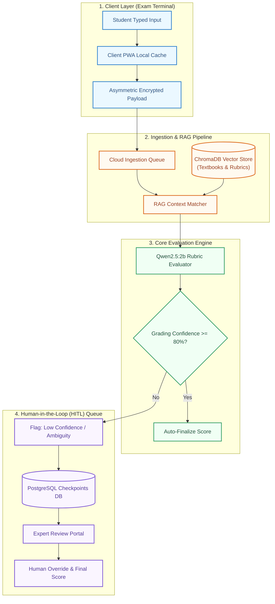

# System Architecture: EvalAI Grading Engine

## Overview
EvalAI is a deterministic, high-throughput exam evaluation and security engine. It utilizes an **Offline-First Exam Delivery Model**, a **Vector-RAG Context Retrieval Pipeline**, and a **LangGraph State Machine** driven by local open-weight LLMs (`Qwen2.5:2b`) to evaluate typed student responses while routing edge cases to human experts.

---

## High-Level Architecture

## Core Operational Phases

1. **Offline-First Client** 
    - **LayerTerminal**: Runs a Progressive Web App (PWA) on local exam center LANs.
    - **Resilience**: Caches state locally so power or network drops do not affect active student exams.
    - **Data Security**: Answers are encrypted locally using asymmetric keys before cloud transmission.

2. **Retrieval-Augmented Generation (RAG) Pipeline**
    - **Storage**: Textbooks and official grading rubrics are split into 500–1000 token chunks and indexed in a local ChromaDB instance using Qwen Text Embeddings.
    - **Runtime**: When a student answer is received, the RAG matcher retrieves the top 2 matching textbook snippets and official question rubrics to form the prompt context.

3. **LangGraph Evaluation Engine**
    - **Execution**: A state machine invokes a local Qwen2.5:2b model via structured JSON output mode.
    - **Routing**: 
        - **Confidence $\ge$ 80%**: The score, rationale, and retrieved context are written directly to the database.
        - **Confidence $<$ 80%**: Execution state pauses and persists to PostgreSQL as REQUIRES_HUMAN_REVIEW.

4. **Human-in-the-Loop (HITL) Exception Queue**
    - Human reviewers evaluate low-confidence or flagged submissions via an administrative dashboard.
    - Submitting an override updates the grade and resumes the thread state in LangGraph.
    - Review logs serve as continuous fine-tuning data for future prompt calibration.